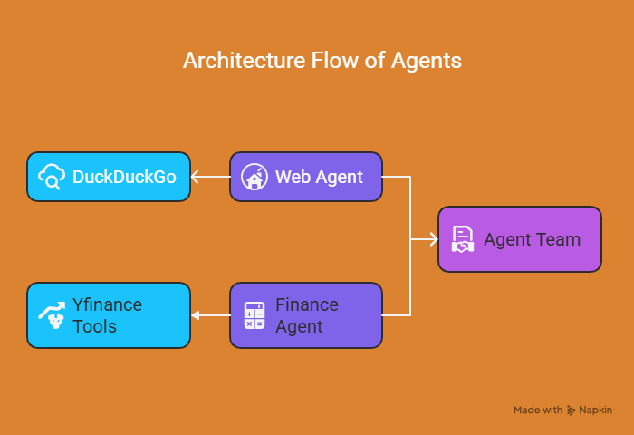

# Simple-Agentic-Finance-Analyst

This repository contains the implementation of an AI Agent specifically designed for financial analysis, built using the Phidata framework and leveraging OpenAI's powerful Large Language Models (LLMs). The project demonstrates how to create both single-purpose and a team of AI agents that can compare stocks, fetch real-time data, and provide insightful summaries

## Features

Single Agents

Web Agent - The web agent has access to the DuckDuckGo web search to fetch the sources as refernces.

Finance Agent - The finance agent has access to the YFinance tool (Yahoo Finance) to get the stock market results of the desired stock

Agentic Team

Agent Team - Team of agents comprising both web and finance agent to access both the stock market data and latest news on the company to provide in depth analyst recommendations.

## Architecture Diagram

