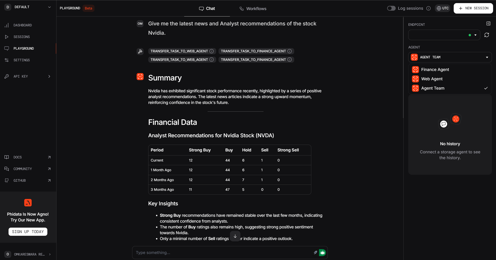

# Simple-Agentic-Finance-Analyst

This repository contains the implementation of an AI Agent specifically designed for financial analysis, built using the Phidata framework and leveraging OpenAI's powerful Large Language Models (LLMs). The project demonstrates how to create both single-purpose and a team of AI agents that can compare stocks, fetch real-time data, and provide insightful summaries

## Features

**Single Agents**

- Web Agent - The web agent has access to the DuckDuckGo web search to fetch the sources as refernces.

- Finance Agent - The finance agent has access to the YFinance tool (Yahoo Finance) to get the stock market results of the desired stock

**Agentic Team**

- Agent Team - Team of agents comprising both web and finance agent to access both the stock market data and latest news on the company to provide in depth analyst recommendations.

## Architecture Diagram


## Set-up

1. To get started we need to install the necessary dependencies mentioned in the `requirements.txt` using the following command

```commandline
    pip install -r requirements.txt
```

2. To access the Phidata's chat playground, set up an account with Phidata, get the api key and export the api key to your windows environment.

```commandline
    setx PHI_API_KEY phi-***
```

3. To test the agents in the chat playground of  Phidata's, run the following command, a locally hosted URL is generated, test the agents in the chat playground.

```commandline
    python playground.app
```

**Chat Playground Display**


